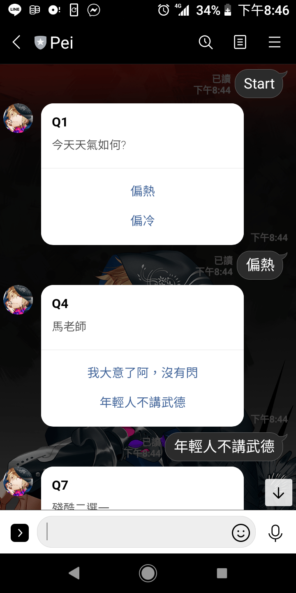
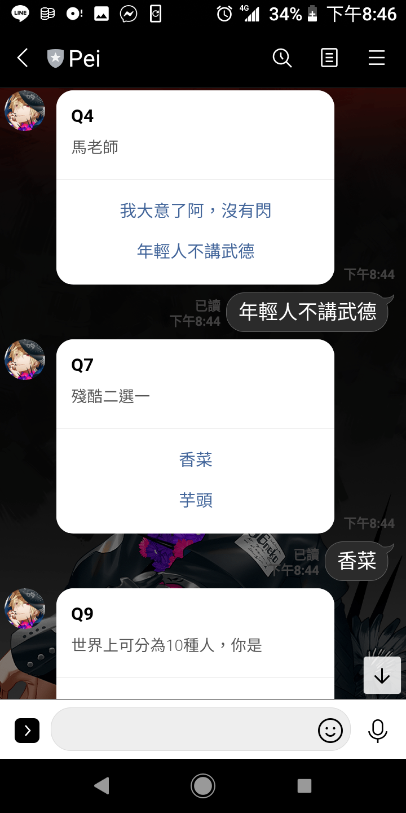
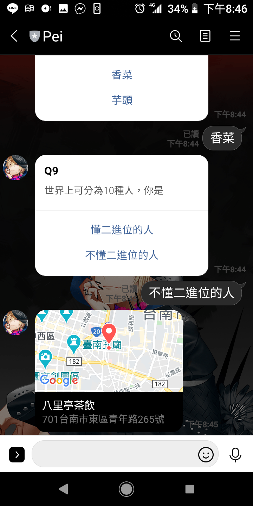
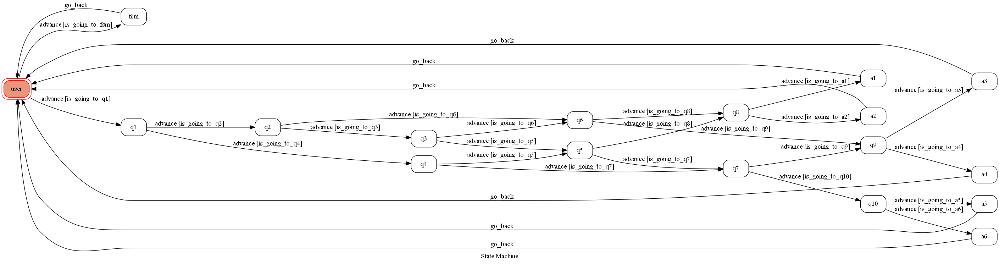

# TOC Project 2020


[](https://codeclimate.com/github/NCKU-CCS/TOC-Project-2020/maintainability)

[](https://snyk.io/test/github/NCKU-CCS/TOC-Project-2020)


Template Code for TOC Project 2020

A Line bot based on a finite state machine

More details in the [Slides](https://hackmd.io/@TTW/ToC-2019-Project#) and [FAQ](https://hackmd.io/s/B1Xw7E8kN)

## About
想喝飲料但不知道要喝啥嗎?輸入start測驗今日要喝哪一家店吧~
還貼心附上地圖資訊哦

## Final work




## Setup

### Prerequisite
* Python 3.6
* Pipenv
* Facebook Page and App
* HTTPS Server

#### Install Dependency
```sh
pip3 install pipenv

pipenv --three

pipenv install

pipenv shell
```

* pygraphviz (For visualizing Finite State Machine)
    * [Setup pygraphviz on Ubuntu](http://www.jianshu.com/p/a3da7ecc5303)
	* [Note: macOS Install error](https://github.com/pygraphviz/pygraphviz/issues/100)


#### Secret Data
You should generate a `.env` file to set Environment Variables refer to our `.env.sample`.
`LINE_CHANNEL_SECRET` and `LINE_CHANNEL_ACCESS_TOKEN` **MUST** be set to proper values.
Otherwise, you might not be able to run your code.

#### Run Locally
You can either setup https server or using `ngrok` as a proxy.

#### a. Ngrok installation
* [ macOS, Windows, Linux](https://ngrok.com/download)

or you can use Homebrew (MAC)
```sh
brew cask install ngrok
```

**`ngrok` would be used in the following instruction**

```sh
ngrok http 8000
```

After that, `ngrok` would generate a https URL.

#### Run the sever

```sh
python3 app.py
```

#### b. Servo

Or You can use [servo](http://serveo.net/) to expose local servers to the internet.


## Finite State Machine


## Usage
The initial state is set to `user`.

Every time `user` state is triggered to `advance` to another state, it will `go_back` to `user` state after the bot replies corresponding message.

- user
	- input: "fsm"
		- go to "fsm"
	- input: "start"
		- go to "q1"
- fsm
	- reply: fsm.png
		- go to "user"		
- q1
	- input: "偏熱"
		- go to "q4"
	- input: "偏冷"
		- go to "q2"
- q2
	- input: "還不錯"
		- go to "q6"
	- input: "不好"
		- go to "q3"
- q3
	- input: "盆栽要剪，小吉要扁"
		- go to "q6"
	- input: "摸摸可愛小吉><"
		- go to "q5"
- q4
	- input: "我大意了阿，沒有閃"
		- go to "q5"
	- input: "年輕人不講武德"
		- go to "q7"
- q5
	- input: "哇！珍妮佛羅培茲！"
		- go to "q7"
	- input: "妳剛攻擊我的村莊？"
		- go to "q8"
- q6
	- input: "古道西風瘦馬。"
		- go to "q9"
	- input: "古道梅子綠茶。"
		- go to "q8"
- q7
	- input: "香菜"
		- go to "q9"
	- input: "芋頭"
		- go to "q10"
- q8
	- input: "買1顆橘子"
		- go to "a1"
	- input: "買5顆橘子+1顆蘋果"
		- go to "a2"
- q9
	- input: "懂二進位的人"
		- go to "a3"
	- input: "不懂二進位的人"
		- go to "a4"
- q10
	- input: "A"
		- go to "a5"
	- input: "peko"
		- go to "a6"
- a1
	- reply: 杯子社
		- go to "user"
- a2
	- reply: 銀兩
		- go to "user"
- a3
	- reply: 海鷗
		- go to "user"
- a4
	- reply: 八里亭
		- go to "user"
- a5
	- reply: 初牧
		- go to "user"
- a6
	- reply: 注春
		- go to "user"

## Deploy
Setting to deploy webhooks on Heroku.

### Heroku CLI installation

* [macOS, Windows](https://devcenter.heroku.com/articles/heroku-cli)

or you can use Homebrew (MAC)
```sh
brew tap heroku/brew && brew install heroku
```

or you can use Snap (Ubuntu 16+)
```sh
sudo snap install --classic heroku
```

### Connect to Heroku

1. Register Heroku: https://signup.heroku.com

2. Create Heroku project from website

3. CLI Login

	`heroku login`

### Upload project to Heroku

1. Add local project to Heroku project

	heroku git:remote -a {HEROKU_APP_NAME}

2. Upload project

	```
	git add .
	git commit -m "Add code"
	git push -f heroku master
	```

3. Set Environment - Line Messaging API Secret Keys

	```
	heroku config:set LINE_CHANNEL_SECRET=your_line_channel_secret
	heroku config:set LINE_CHANNEL_ACCESS_TOKEN=your_line_channel_access_token
	```

4. Your Project is now running on Heroku!

	url: `{HEROKU_APP_NAME}.herokuapp.com/callback`

	debug command: `heroku logs --tail --app {HEROKU_APP_NAME}`

5. If fail with `pygraphviz` install errors

	run commands below can solve the problems
	```
	heroku buildpacks:set heroku/python
	heroku buildpacks:add --index 1 heroku-community/apt
	```

	refference: https://hackmd.io/@ccw/B1Xw7E8kN?type=view#Q2-如何在-Heroku-使用-pygraphviz

## Reference
[Pipenv](https://medium.com/@chihsuan/pipenv-更簡單-更快速的-python-套件管理工具-135a47e504f4) ❤️ [@chihsuan](https://github.com/chihsuan)

[TOC-Project-2019](https://github.com/winonecheng/TOC-Project-2019) ❤️ [@winonecheng](https://github.com/winonecheng)

Flask Architecture ❤️ [@Sirius207](https://github.com/Sirius207)

[Line line-bot-sdk-python](https://github.com/line/line-bot-sdk-python/tree/master/examples/flask-echo)
